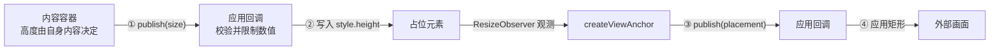

# 双向几何设计

view-anchor 支持双向几何同步：

- **正向（`createViewAnchor`）**：测量 DOM 占位元素的可见性和位置尺寸，通过 `publish(placement)` 把 `{ visible: true, bounds }` 或 `{ visible: false }` 交给应用，由应用更新外部画面。
- **反向（`createSizeAnchor`）**：内容区域测量自身尺寸，通过 `publish(size)` 把 `{ axis, extent }` 交给应用，由应用调整占位元素大小。

常见场景：嵌套在宿主中的工具栏或面板，其宽度由宿主布局决定，高度则由子视图自身的内容决定。

## 1. 正向与反向的调度差异

- **正向（`createViewAnchor`）同步发布。** 外部画面的更新本身可能已有延迟；测量后再等一次 `requestAnimationFrame` 会增加拖拽时的跟随延迟。正向在 `ResizeObserver` 和窗口 `resize` 回调中同步测量并调用 `publish(placement)`。默认 `dedupe: true`，与上一次接受的 `Placement` 完全相同时跳过发布；传 `dedupe: false` 则每次测量都发布，即使值不变。
- **反向（`createSizeAnchor`）用 RAF 调度。** 反向构成一条反馈环：内容上报尺寸 → 应用调整占位大小 → 内容重新布局与测量 → 再次上报。将上报频率限制在每帧至多一次能避免高频震荡。同样默认 `dedupe: true`；`dedupe: false` 时每次测量都发布，即使 extent 不变。

## 2. 反向接口说明

```ts
export type SizeAxis = 'block' | 'inline'

export interface SizeMeasurement {
  readonly axis: SizeAxis   // 固定轴，供宿主做白名单检查
  readonly extent: number         // 目标元素该轴的 border-box 尺寸（CSS 像素），四舍五入且 >= 0
}

export interface SizeAnchorOptions {
  axis: SizeAxis            // 创建后固定，每个 size anchor 只负责一条轴
  publish: Publisher<SizeMeasurement> // 接收尺寸发布的回调
  signal?: AbortSignal            // abort 后停止监听并取消已排队的帧
  dedupe?: boolean                 // 默认 true，与上次发布的 extent 相同则跳过
}

export interface SizeAnchorHandle {
  update(opts: { publish: Publisher<SizeMeasurement>; dedupe?: boolean }): void // 应用一份完整的新选项并立即重新报告当前尺寸；省略 dedupe 重置为默认值 true
  dispose(): void                                  // 停止监听并取消 RAF
}

export function createSizeAnchor(
  target: HTMLElement,
  opts: SizeAnchorOptions,
): SizeAnchorHandle
```

- 运行在下游视图的渲染环境中；从 `ResizeObserverEntry.borderBoxSize` 直接读取尺寸，避免在回调中触发 `getBoundingClientRect` 引起强制回流（reflow）。
- 上报前会执行 `Math.round` 取整并钳位至 `>= 0`。
- 目标元素 `target` 应当在所负责的轴上根据内容自适应（shrink-to-fit），不能被宿主设置的尺寸反向影响。
- 如果需要同时汇报宽和高，应当针对不同轴分别创建两个独立的 size anchor，而不是放在同一条消息中，以保持数据流向的清晰。
- 节流场景下丢弃这次值应返回 `false` 以便之后重试；只保留最新值稍后发送的节流无需关闭 `dedupe`。

## 3. 单轴控制与收敛性

为了避免死循环，必须遵循单轴控制原则：

- 一个 size anchor 只测量并上报它负责的那条轴；另一条轴由应用单向设置，内容区域只读。
- 典型案例：宿主决定宽度，下游决定高度。因为高度是内容流式排版的结果而不是输入，整个尺寸传递构成一个有向无环图（DAG），更新在单步内即可收敛。
- 如果内容的高度又反过来改变宽度（或测量了 `<body>`/`<html>`），就会形成循环调整，导致界面抖动。

## 4. 职责与信任边界

下游视图可能运行不可信或第三方代码，因此上报的尺寸应当被当作不可信输入处理。

| 职责 | 负责方 | 说明 |
|---|---|---|
| 数值取整 | view-anchor | 避免传递非整数像素 |
| 过滤 NaN / Infinity | view-anchor | 丢弃异常无效数值 |
| 负数归零 | view-anchor | 保证尺寸非负，反映真实测量结果 |
| 视口限制（clamp） | 宿主 | 依据当前窗口可用空间对上报值做范围约束，防止异常大值 |
| 来源身份校验 | 应用 | 在接收数据前验证调用方或通道是否可信 |
| 轴白名单校验 | 宿主 | 检查 `axis` 是否与宿主预期的控制轴一致 |
| 位置与层级锁定 | 宿主 | 下游不能擅自修改自身的坐标位置或 z-index |

如果把 `target` 设为 `document.body` 或 `documentElement`，其尺寸直接等于宿主给定的视口大小，无法正确收缩。`createSizeAnchor` 在初始化时会输出一次控制台警告。

## 5. 宿主与下游的配合方式

正向与反向通过宿主中的占位 DOM 元素连接：

- 下游的 `createSizeAnchor` 将内容尺寸通知宿主，宿主更新占位元素的高度。
- 宿主的 `createViewAnchor` 监听占位元素的矩形变化，将新位置同步给外部视图。



1. **内容区域**：通过 `createSizeAnchor` 测量高度并调用 `publish(size)`。
2. **应用**：限制收到的高度（例如在 `minHeight` 和 `maxHeight` 之间），然后写入占位元素的样式。
3. **占位元素**：尺寸改变后，`createViewAnchor` 的 `ResizeObserver` 会测量新的 `Placement` 并调用 `publish(placement)`。
4. **应用**：把 `visible`/`bounds` 用于定位或隐藏外部画面。

## 6. 何时需要反向尺寸上报

只有外部画面的内容尺寸需要反过来改变宿主布局时，才需要 `createSizeAnchor`；应用已经能直接知道或设置这个尺寸时，不需要反向链路。保持"一个方向只控制一个轴"，并在应用侧限制接收值，能避免尺寸互相驱动导致的抖动。
