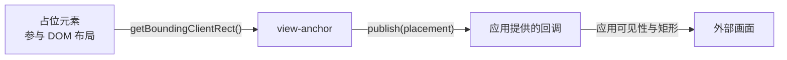

# view-anchor

将外部画面实时对齐到指定的 DOM 元素。核心逻辑通过 `getBoundingClientRect()` 测量目标元素，并把 `Placement` 交给 `publish` 回调；应用代码决定如何使用它。

核心不依赖 React、特定宿主或布局引擎；React 相关的逻辑均隔离在 `view-anchor/react` 适配层中。

> **在线演示**：[3D 交互演示](https://lbb00.github.io/view-anchor/) 运行真实核心代码。直接在 3D 场景里拖动分隔条、滚动页面、点击按钮：画面 A 跟随占位元素；画面 B 把自己的内容高度报回页面，页面据此调整它的占位。每个操作对应一项能力，可关掉 `followGeometry` / `followScroll` 对比不跟随时的错位。源码见 [index.html](./index.html)。

## 运行机制



占位元素参与 DOM 布局，外部画面由应用代码定位。`view-anchor` 只负责测量和调用 `publish(placement)`；它不创建外部画面，也不决定数据通过什么方式到达那里。

## createViewAnchor(target, opts)

命令式核心接口，将外部画面绑定到目标元素，返回 `{ update, pulse, dispose }`。发布的值是一个显式可见性的判别联合类型 `Placement`，区分“确实可见但尺寸为 0x0”和“隐藏或未挂载”这两种情况：

```ts
const handle = createViewAnchor(target, {
  visible: true,                 // 显式控制可见性
  publish(placement) {
    if (placement.visible) applyBounds(placement.bounds)
    else hideSurface()
  },
})
```

| 选项 / 操作 | 行为 |
|---|---|
| `visible: true` | 立即发布 `{ visible: true, bounds }`，之后每次 `ResizeObserver` 触发或窗口 `resize` 时同步重新测量。 |
| `visible: false` | 发布 `{ visible: false }`，停止观察。`publish` 拒绝时不会自动重发，再次调用 `update()` 才会重发。 |
| `dedupe`（默认 true） | 与上一次接受的 `Placement` 完全相同（含 `visible` 状态）时跳过发布；传 `false` 则每次测量都调用 `publish`，即使值不变。 |
| `treatZeroAreaAsHidden`（默认 false） | 开启后，测出零面积的元素发布 `{ visible: false }`，并挂载 `IntersectionObserver` 捕捉 `display: none` 切换。 |
| `followScroll`（默认 false） | 滚动时重新测量。`window` 捕获阶段监听处理能到达页面的事件；可滚动祖先监听处理脱离文档或在 Shadow DOM 中、到不了 `window` 的事件。同一次事件只处理一次，包括 `dedupe: false` 时。 |
| `followGeometry`（默认 false） | 在需要时启动单帧 RAF 轮询，捕获没有 DOM 事件的祖先 transform 或布局位移；几何稳定后自动停止。也可通过 `pulse()` 手动触发。 |
| `pulse(durationMs?)` | 手动打开 RAF 跟随窗口，稳定后或超时后自动停止。分隔条拖拽时，每次 `pointermove` 更新布局后调用 `pulse()`；只在按下时调用一次无法覆盖停顿后的移动。 |
| `update(opts)` | 应用一份完整的新选项并立即重新测量一次；省略的选项一律重置为其默认值（与创建时相同），不会保留上一次的设置。 |
| `dispose()` / `AbortController.abort()` | 停止所有监听并释放资源，此后不再发布。 |

测量结果使用 `Math.round` 取整。`width` 和 `height` 会限制为 `>= 0`，但 `x` 和 `y` 允许为负数。当元素滚动出视口上边缘或左边缘时，原点自然会是负值，保留负值可以让视图正常跟随元素滚出屏幕。测出的 `left`/`top`/`width`/`height` 若含 `NaN` 或 `Infinity`，这一帧会被丢弃、不调用 `publish`，保留上一个有效基线。

同步发布的原因：外部画面的更新本身可能已经有延迟。若测量后再等一帧，拖拽时会多出一帧跟随延迟。在 observer 回调中直接测量并调用 `publish` 可以避免这一步等待。

去重（`dedupe: true`）：同一帧或连续多次触发中，只要新的 `Placement` 与上一次成功接受的值不完全相同就会调用 `publish`；完全相同则跳过。`update()` 会立即强制重新发布一次，即使矩形不变，也能把新的应用状态重新交给回调。需要每次测量都收到通知（例如驱动一个自身也做节流/采样的下游）时，传 `dedupe: false`：这时每次 `ResizeObserver`/`resize`/`scroll` 触发、以及 `followGeometry` 轮询到的每一帧可见且有效的测量，都会调用 `publish`，隐藏帧仍然不会被发布。

调用 `dispose()`、`AbortController.abort()` 或更新为 `visible: false` 后，内部状态会立即置为停用，后续任何异步触发都会直接返回，避免过期数据覆盖新状态。

## useViewAnchor(opts)

React 适配层，从 `view-anchor/react` 导出，将 `createViewAnchor` 的选项接入 React ref 生命周期，返回用于挂载在占位元素上的 ref 回调。

```tsx
import { useViewAnchor } from 'view-anchor/react'

const ref = useViewAnchor({
  visible,             // boolean
  publish,             // Publisher<Placement>，同步返回 false 表示未接收
  deps: [signature],   // 可选：影响位置但不会触发 ResizeObserver 的外部依赖
})
return <div ref={ref} />
```

在 React 分隔条的 `pointermove` 处理函数中，先更新布局，再调用 `ref.pulse()`。这个方法作用于当前挂载的 anchor；未挂载或 `followGeometry` 关闭时不会启动帧跟随。

| 时机 | 行为 |
|---|---|
| 挂载 | 创建 anchor 实例并开始监听 |
| `opts` 或 `deps` 变化 | 调用 `update` 更新参数 |
| 卸载 | 在 microtask 内发布 `{ visible: false }` 并释放资源；如果之前的隐藏已被接受则不再重复发送，被拒绝过则补发一次 |

`deps`：`ResizeObserver` 只在元素自身的 border-box 改变时触发。如果页面上有某些状态会移动元素位置却不改变其尺寸（例如兄弟节点切换、路由跳转、复杂的外部布局更新），可将这些状态放入 `deps`。

省略语义与 `createViewAnchor`、命令式 `update()` 相同：每次调用都会重新应用一份完整的选项，省略的选项一律重置为默认值，而不是沿用上一次的值。`treatZeroAreaAsHidden`、`followScroll`、`followGeometry` 省略即为 `false`；`dedupe` 省略回到默认值 `true`。

React 18 在卸载时会传入 `ref(null)`，React 19 支持 ref 清理函数。适配层将卸载通知推迟一个微任务执行：React 19 在 StrictMode 下开发阶段的快速卸载重挂载会被就地取消，真正的卸载则在微任务内正常触发清理。

## 模块结构

| 文件 | 用途 |
|---|---|
| `src/view-anchor.ts` | 正向命令式核心：`createViewAnchor`、`measurePlacement`。不含 React 或宿主依赖。 |
| `src/react.ts` | React 适配层：`useViewAnchor`。 |
| `src/size-anchor.ts` | 反向核心：`createSizeAnchor`，含每帧至多一次的 RAF 调度与去重。 |
| `src/types.ts` | 类型定义（`Bounds`、`Placement`、各模块配置与句柄）。 |
| `src/abort.ts` | 内部实现：标准 `AbortSignal` 监听与注销辅助。 |
| `src/index.ts` | 根入口，导出核心几何方法（`useViewAnchor` 只从 `view-anchor/react` 导出，根入口不依赖 React）。 |

消息协议模块（`src/protocol.ts`、`src/protocol-publisher.ts` 等）详见 [通信协议设计文档](./protocol.md)。

核心运行时仅依赖标准 Web API（`ResizeObserver`、`getBoundingClientRect`、`addEventListener`）；`requestAnimationFrame` 仅在反向模块与可选的 `followGeometry` 中按需使用。
