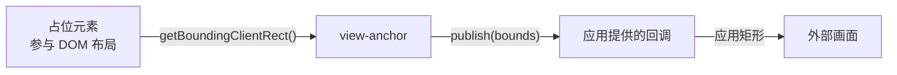

# view-anchor

将外部画面实时对齐到指定的 DOM 元素。核心逻辑通过 `getBoundingClientRect()` 测量目标元素，并把矩形数据交给 `publish` 回调；应用代码决定如何使用这个矩形。

核心不依赖 React、特定宿主或布局引擎；React 相关的逻辑均隔离在 `view-anchor/react` 适配层中。

> **在线演示**：[3D 交互演示](https://lbb00.github.io/view-anchor/) 运行真实核心代码。拖动分栏、切换面板显示，看外部视图实时跟随。源码见 [index.html](./index.html)。

## 运行机制



占位元素参与 DOM 布局，外部画面由应用代码定位。`view-anchor` 只负责测量和调用 `publish(bounds)`；它不创建外部画面，也不决定矩形通过什么方式到达那里。

## createViewAnchor(target, opts)

命令式核心接口，将外部画面绑定到目标元素，返回 `{ update, dispose }`。

```ts
const handle = createViewAnchor(target, {
  present: true,
  publish(bounds) {
    applyBounds(bounds)
  },
})
```

| 状态 / 操作 | 行为 |
|---|---|
| `present: true` | 立即发布测量矩形，之后每次 `ResizeObserver` 触发或窗口 `resize` 时同步重发。 |
| `present: false` | 停止观察，发布一次 `{ x: 0, y: 0, width: 0, height: 0 }`。 |
| `update(opts)` | 应用新选项，重置去重缓存并立即重新发布一次。 |
| `dispose()` / `AbortController.abort()` | 停止所有监听并释放资源，此后不再发布。 |

测量结果使用 `Math.round` 取整。`width` 和 `height` 会限制为 `>= 0`（0 代表收起），但 `x` 和 `y` 允许为负数。当元素滚动出视口上边缘或左边缘时，原点自然会是负值，保留负值可以让视图正常跟随元素滚出屏幕。

**为什么同步发布而不走 RAF：** 外部画面的更新本身可能已经有延迟。若测量后再等一帧，拖拽时会多出一帧跟随延迟。在 observer 回调中直接测量并调用 `publish` 可以避免这一步等待。同帧多次触发时，只要 4 个矩形数值有一项发生变化便会调用 `publish`，与上一帧完全一致则跳过。调用 `update` 会清除去重基线，因此即使矩形不变，也能把新的应用状态重新交给回调。

调用 `dispose()`、`AbortController.abort()` 或更新为 `present: false` 后，内部状态会立即置为停用，后续任何异步触发都会直接返回，避免过期数据覆盖新状态。

## 收起与零矩形

- **`present`**：标识外部画面当前是否需要显示。
- **`{ x: 0, y: 0, width: 0, height: 0 }`（零矩形）**：收起信号。应用可以把它解释为隐藏、移除，或仅保留最后一个状态。
- **dispose 行为**：`dispose()` 只停止监听，不补发零矩形。如果需要在元素移除时通知宿主收起视图，应当在 dispose 之前调用 `update({ present: false, ... })`，React 适配层已自动处理了该生命周期。

## 显式可见性（createPlacementAnchor）

`createViewAnchor` 使用零矩形表示收起，无法区分“隐藏”与“元素确实存在但尺寸为 0x0”的情况。`createPlacementAnchor` 采用显式的 `Placement` 判别联合类型：

```ts
const handle = createPlacementAnchor(target, {
  visible: true,                 // 显式控制可见性
  publish: (placement) => { ... },
})
```

| 选项 / 操作 | 行为 |
|---|---|
| `visible: true` | 发布 `{ visible: true, bounds }`，并在尺寸变化时同步重发。 |
| `visible: false` | 发布 `{ visible: false }`，停止观察。 |
| `guardDisplayNone`（默认 false） | 开启后，测出零面积的元素发布 `{ visible: false }`，并挂载 `IntersectionObserver` 捕捉 `display: none` 切换。 |
| `followScroll`（默认 false） | 在捕获阶段监听 `window` 的 `scroll` 事件，祖先容器滚动时重新测量。 |
| `followGeometry`（默认 false） | 在需要时启动单帧 RAF 轮询，捕获没有 DOM 事件的祖先 transform 或布局位移；几何稳定后自动停止。也可通过 `pulse()` 手动触发。 |

去重逻辑会同时对比 `visible` 状态，因此可见性切换不会被同值去重误吞。

## useViewAnchor(opts)

React 适配层，从 `view-anchor/react` 导出，返回用于挂载在占位元素上的 ref 回调。

```tsx
import { useViewAnchor } from 'view-anchor/react'

const ref = useViewAnchor({
  present,            // boolean
  publish,            // Publisher<Bounds>，同步返回 false 表示未接收
  deps: [signature],  // 可选：影响位置但不会触发 ResizeObserver 的外部依赖
})
return <div ref={ref} />
```

| 时机 | 行为 |
|---|---|
| 挂载 | 创建 anchor 实例并开始监听 |
| `opts` 或 `deps` 变化 | 调用 `update` 更新参数 |
| 卸载 | 在 microtask 内发布零矩形并释放资源 |

**`deps` 参数**：`ResizeObserver` 只在元素自身的 border-box 改变时触发。如果页面上有某些状态会移动元素位置却不改变其尺寸（例如兄弟节点切换、路由跳转、复杂的外部布局更新），可将这些状态放入 `deps`。

React 18 在卸载时会传入 `ref(null)`，React 19 支持 ref 清理函数。适配层将卸载通知推迟一个微任务执行：React 19 在 StrictMode 下开发阶段的快速卸载重挂载会被就地取消，真正的卸载则在微任务内正常触发清理。

## usePlacementAnchor(opts)

同样导出自 `view-anchor/react`，将 `createPlacementAnchor` 的 `visible`、`followScroll`、`followGeometry` 与 `guardDisplayNone` 接入 React ref 生命周期。真正卸载时会发布 `{ visible: false }` 并释放监听。

## 模块结构

| 文件 | 用途 |
|---|---|
| `src/view-anchor.ts` | 正向命令式核心：`createViewAnchor`、`createPlacementAnchor`、`measurePlacement`。不含 React 或宿主依赖。 |
| `src/react.ts` | React 适配层：`useViewAnchor` 与 `usePlacementAnchor`。 |
| `src/size-advertiser.ts` | 反向核心：`createSizeAdvertiser`。 |
| `src/measure-loop.ts` | 反向专用的 RAF 调度与去重循环（内部实现，不对外导出）。 |
| `src/types.ts` | 类型定义（`Bounds`、`Placement`、各模块配置与句柄）。 |
| `src/abort.ts` | 内部实现：标准 `AbortSignal` 监听与注销辅助。 |
| `src/index.ts` | 根入口，导出核心几何方法并兼容性重导出 `useViewAnchor`。 |

消息协议模块（`src/protocol.ts`、`src/protocol-publisher.ts` 等）详见 [通信协议设计文档](./protocol.md)。

核心运行时仅依赖标准 Web API（`ResizeObserver`、`getBoundingClientRect`、`addEventListener`）；`requestAnimationFrame` 仅在反向模块与可选的 `followGeometry` 中按需使用。
