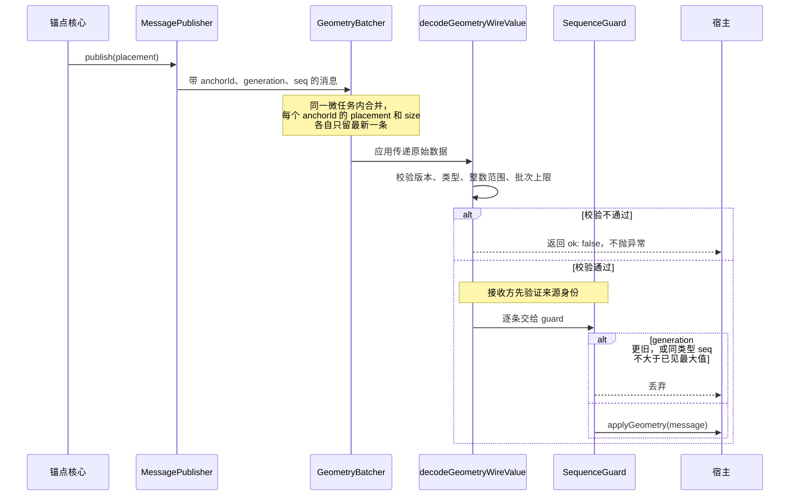

# 通信协议

`view-anchor` 核心模块只负责测量并同步调用 `publish`。如果应用要把几何数据交给异步或不完全可信的通道，可以使用可选的 `view-anchor/protocol` 模块。它提供带版本的消息结构、输入校验、消息防乱序和微任务批处理，不绑定具体的传递方式。

一条消息从锚点走到宿主要经过的环节：



## 消息结构

协议消息包含以下字段：

- `v: 1`：协议版本，非支持版本直接拒绝。
- `kind`：消息类型，`placement` 或 `size`。
- `anchorId`：锚点的唯一逻辑标识符。
- `generation`：代次编号。锚点重建或需要完全重置序列时递增，用于丢弃上一代残留的迟到消息。
- `seq`：同一 publisher 内单调递增的序列号。
- `placement` 或 `size`：具体的位置或尺寸数据。

`generation` 作用于同一个 `anchorId`：一旦接收到新一代的消息，所有该锚点的旧代消息都会被直接丢弃。`generation` 与 `seq` 只负责保证消息顺序，不作为鉴权凭据。接收端仍应在分发前验证来源身份。

## 发送端

```ts
import {
  createGeometryBatcher,
  createPlacementMessagePublisher,
} from 'view-anchor/protocol'

const batcher = createGeometryBatcher(
  sendGeometryBatch,
  { onError: (err) => console.error(err) },
)

const publish = createPlacementMessagePublisher(
  { anchorId: 'editor', generation: 1 },
  batcher.publish,
)
```

1. **每个 `{ anchorId, generation }` 保持单个 publisher 实例**。在 React 中应使用 `useMemo` 或 `useRef` 保存，不要在每次渲染时重新创建。接收端的 `createGeometrySequenceGuard` 会按 `placement` 和 `size` 分别记录见过的最大序列号；如果在同一代次下重建 publisher，序列号会从 1 重新计数，导致新发出的消息被当成过期消息丢弃。确实需要重置时，请将 `generation` 加一。
2. **批处理与重试**。`createGeometryBatcher` 会在当前微任务中合并同一事件循环内的多次更新，每个锚点的 `placement` 和 `size` 各自只保留最新的一条。如果下游发送失败或抛出异常，未成功发送的消息会保留在队列中，等待下次调用或显式 `flush()` 时重试。

当锚点销毁时，可以调用 `batcher.clear(anchorId)` 清理对应队列；调用 `dispose()` 会彻底停用批处理器。

## 接收端

```ts
import {
  createGeometrySequenceGuard,
  decodeGeometryWireValue,
} from 'view-anchor/protocol'

const guard = createGeometrySequenceGuard()
const result = decodeGeometryWireValue(event.payload, { maxMessages: 100 })

if (result.ok) {
  const messages = result.value.kind === 'batch'
    ? result.value.messages
    : [result.value]

  for (const message of messages) {
    if (
      isAuthorized(message.anchorId) &&
      guard.accept(message)
    ) {
      applyGeometry(message)
    }
  }
}
```

`decodeGeometryWireValue` 接收 `unknown` 类型的原始数据，执行严格的类型和边界检查（包括整数范围、非负尺寸、批次大小限制等），不会向外抛出异常。

## publish 回调的同步约定

所有 `Publisher<T>` 均为同步函数：
- 返回 `true` 或 `void`：表示数据已成功接收或已加入发送队列。
- 返回 `false`：表示当前未接收。核心会在下一次测量触发时重新尝试该值。隐藏状态不再测量，所以被拒绝的 `{ visible: false }` 不会自动重发，要等下一次 `update()`；`useViewAnchor` 会在卸载时补发。

如果底层传递是异步的，应当先在同步回调中将消息放入本地队列并返回 `true`，后续的重试由发送队列自行管理。

## 已知局限：协议不负责的事

- **不验证来源和权限**。`generation`、`seq` 只保证顺序，不是鉴权凭据；协议不检查 sender、origin、能力 token，也不判断某个 `anchorId` 是否允许某个来源写入。这些必须由接收端在调用 `guard.accept()` 之前完成（见上文“接收端”示例中的 `isAuthorized`）。
- **不是窗口级的原子快照**。一个 batch 里只包含这次微任务入队的消息；没有更新的锚点不会出现在这个 batch 里，不能把它当作整个窗口状态在某一时刻的完整快照。
- **不分配或递增 `generation`**。何时开始新的一代、`generation` 取什么值，完全由应用决定；协议只负责按 `generation` 做新旧判断。
- **只接受普通对象**。消息及其中的 `placement`、`bounds`、`size` 的原型必须是 `Object.prototype` 或 `null`，也就是 `JSON.parse` 和结构化克隆（`postMessage`）得到的对象；带自定义原型的对象一律拒绝，继承来的字段不会被当成消息内容。如果页面的全局 `Object.prototype` 已被污染，解码器无法防护。
- **关键字段没有上限**。`anchorId` 不限制长度；`createGeometrySequenceGuard` 和 `createGeometryBatcher` 内部按 `anchorId` 建立的 Map 也不限制条目数。接收不可信输入时，应用需要先鉴权，再自行限制这些资源，避免被灌入大量或超长的 `anchorId`。
- **批次上限只管条数**。`decodeGeometryWireValue` 的 `maxMessages` 只检查 `messages` 数组长度，不检查序列化后的总字节数；总体积仍需由传输层或应用自己限制。
- **不负责传输本身**。协议不做重连、确认（ack）或定时重试。发送失败的消息会留在 `GeometryBatcher` 里，直到下一次 `publish()` 产生更新的消息，或显式调用 `flush()`，才会重新尝试。
- **重建 publisher 会被当作旧消息**。同一个 `{ anchorId, generation }` 如果重新创建 `createPlacementMessagePublisher` / `createSizeMessagePublisher`，`seq` 会从 1 重新计数，很可能小于接收端已经记录的最大值而被 `guard` 丢弃。需要重置时应递增 `generation`，而不是重建同代次的 publisher。
